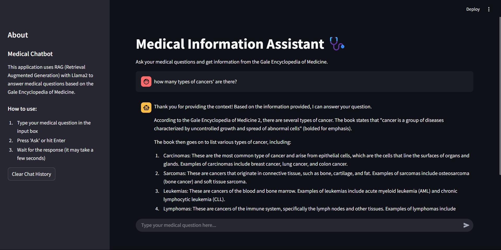
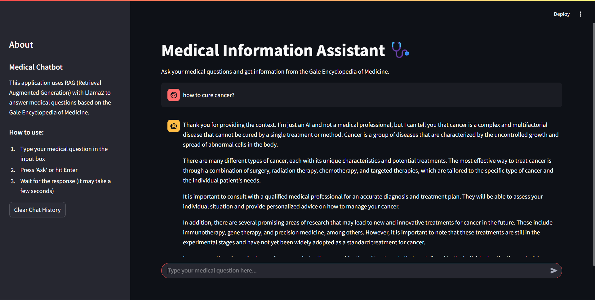
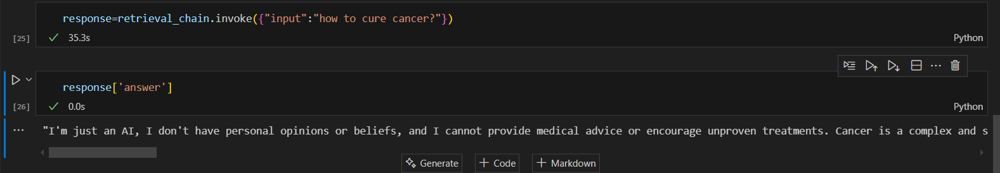
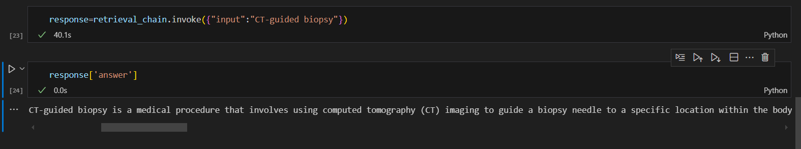
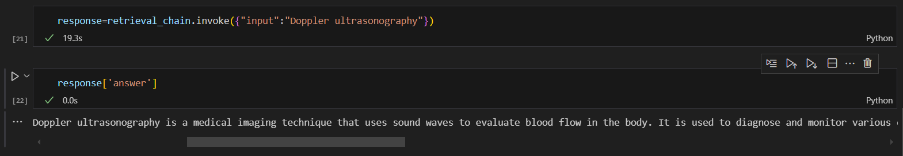

# Medical-Chatbot

> **Note:** This project uses the Llama2 model, which runs locally on your machine. Due to this, online deployment is **not possible** for this project.

## How to Run Locally

1. **Clone the repository** and navigate to the project directory.
2. **Install dependencies** (preferably in a virtual environment):
    ```sh
    pip install -r requirements.txt
    ```
3. **Ensure you have the Llama2 model and Ollama installed locally.**
4. **Run the Streamlit app:**
    ```sh
    streamlit run app.py
    ```
5. Open your browser and go to [http://localhost:8501](http://localhost:8501).

The app should look something like this:






---

## About the Project

This is a Retrieval Augmented Generation (RAG) based chatbot that answers medical queries using the Gale Encyclopedia of Medicine as its knowledge base. It is built with [LangChain](https://www.langchain.com/) and leverages local models for privacy and cost-effectiveness.

- **RAG**: Combines document retrieval with generative AI to provide accurate, context-aware answers.
- **LangChain**: Used for chaining together document loaders, vector stores, and LLMs.
- **Models**: Uses Llama2 and Ollama for both embeddings and language generation, all running locally and free of charge.

### Backend Workflow

Below are some backend process screenshots:




